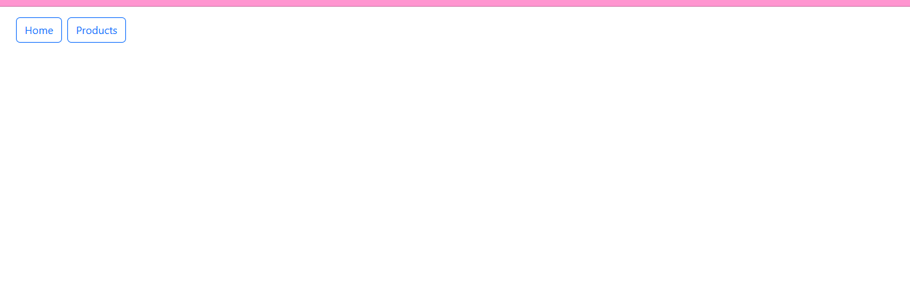
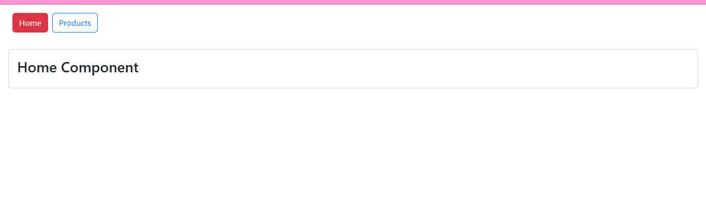
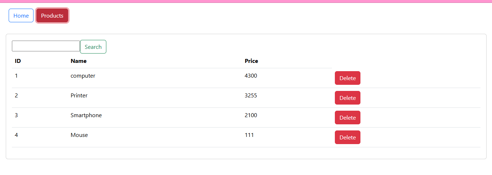
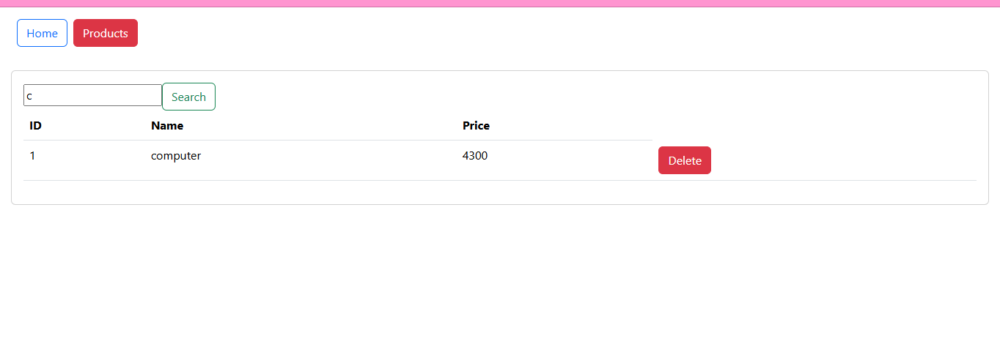
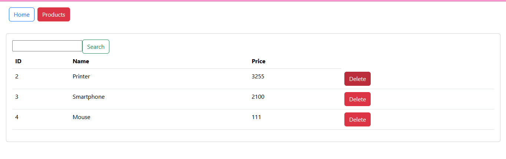

<h1 align="center">Activité Pratique Angular</h1>

  <strong>Une application Angular conçue pour gérer efficacement des produits. Elle permet de consulter et de supprimer des produits, avec une interface utilisateur intuitive et dynamique.</strong>

---

## Aperçu des Captures d'Écran

   
  <em>Figure 1: Vue principale</em>

   
  <em>Figure 2: Page d'accueil de l'application</em>

   
  <em>Figure 3: Liste des produits avec options de gestion</em>

   
  <em>Figure 4: Recherche d'un produit</em>

   
  <em>Figure 5: Suppression d'un produit</em>

